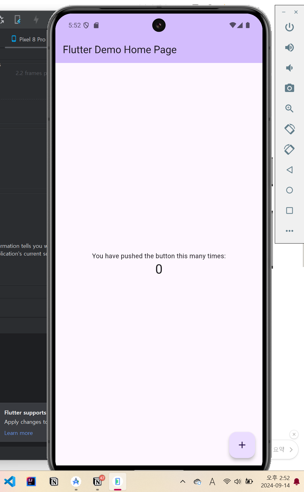

# 0914 과제

<aside>
✨

1. Dart의 클래스 관련 내용 공부 후, 정리해서 올리기
2. Flutter 개발 환경 세팅 후 Flutter 프로젝트 생성하기, Emulator 실행 후 화면 캡쳐해서 올리기
</aside>

## Dart의 클래스 개념

### 1. 클래스와 객체

- 클래스 : 객체를 정의하는 설계도.
    - 모든 클래스는 ‘Object 클래스’의 자식임.
    - 클래스는 멤버 함수(메서드), 멤버 변수(인스턴스 변수)를 가짐.
- 객체 : 클래스에 기반해 생성된 실체.
    - 모든 객체는 클래스의 인스턴스임.
    - 특정 클래스(설계도)에 의해 만들어졌다는 의미.
    - 클래스(설계도)를 사용해 객체를 생성하는 것 = 메모리에 클래스가 올라감 = ‘인스턴스화’

### 2. 객체 지향 언어?

- 모든 데이터를 객체로 봄.
    - int 타입의 변수도 객체, String 타입의 변수도 객체, …
    - 변수뿐 아니라 모든 함수와 클래스도 전부 객체.

### 3. 클래스 사용법

(1) 클래스의 기본 형태 → 멤버 함수(메서드), 멤버 변수(인스턴스 변수)

```dart
class Person {
	
	String name;
	int age;
	
	getName(){
		return name;
	}
	
}
```

(2) 클래스를 사용해서 객체 생성하기 ⇒ new 키워드 생략 가능

```dart
class Person {
	
	String name;
	int age;
	
	getName(){
		return name;
	}
	
}

main(){

var student = new Person();
var teacher = Person();    //이렇게도 가능

}
```

(3) 생성한 객체의 멤버에 접근하기

```dart
class Person {
	
	String name;
	int age;
	
	getName(){
		return name;
	}
	
}

main(){

var teacher = Person();
teacher.name = "Yoon";
teacher.age = "20";

}
```

(4) 타입처럼 사용되는 클래스 이해하기

- String , int 같은 타입도 사실 객체라고 했음. = 보고 만든 설계도(클래스)가 있음.
- 실제로 String 클래스가 존재. 들어가면 확인 가능

- 지금 Person 클래스(설계도)를 만들었고, 이를 통해 객체(teacher..)를 생성했음.
- 우리가 만든 Person 클래스도 String 클래스 같은 타입이 될 수 있음. (=커스텀 타입)

```dart
class Person {
	
	String name;
	int age;
	
	getName(){
		return name;
	}
	
}

main(){

//타입처럼 클래스를 사용할 수 있음
Person teacher = Person();

}
```

- 앞서서 썼던

```dart
var teacher = Person();
```

- 여기서도 타입 var에 Person 타입으로 자동으로 저장된거임.

(5) 매개변수 주면서 클래스 내부의 변수에 할당할 수 있음

```dart
class Person {
	
	String name;
	int age;
	
	getName(){
		return name;
	}
	
	Person(this.age, this.name);
	
}

main(){

//객체 생성할 때 매개변수 주면서 초기화 가능
Person teacher = Person(30, "홍길동");

}
```

- required 키워드 붙이면, 클래스 사용해서 객체 생성할 시 해당 인자는 무조건 입력해야 함
    
    ```dart
    class Person {
    	
    	String name;
    	int age;
    	
    	getName(){
    		return name;
    	}
    	
    	Person(required this.age, required this.name);
    	
    }
    
    main(){
    
    //객체 생성할 때 매개변수 주면서 초기화 가능
    Person teacher = Person(30, "홍길동");
    
    }
    ```
    
- 인자 받을 때 {} 붙여서 받으면, 해당 클래스 부를 때 순서 막 써도 됨. 단, 어떤 변수에 입력하는지 name값 필수로 입력 必
    
    ```dart
    class Person {
    	
    	String name;
    	int age;
    	
    	getName(){
    		return name;
    	}
    	
    	Person({required this.age, required this.name});
    	
    }
    
    main(){
    
    //객체 생성할 때 매개변수 주면서 초기화 가능
    Person teacher = Person(age: 30, name: "홍길동");
    
    }
    ```
    

- 인자 타입에 ? 붙이면 NULL일 수도 있음을 암시
- 인자 타입에 ! 붙이면 NULL이 무조건 아님을 암시

참고자료: 

[08화 다트 클래스 (Dart Class) (brunch.co.kr)](https://brunch.co.kr/@mystoryg/122)

[[Dart] 클래스(class)에 대하여 - 1 (jinhan38.com)](https://jinhan38.com/118)

## Flutter 개발 환경 세팅 및 Flutter 프로젝트 생성하기

참고 자료 : [https://youtu.be/2K2NlqWHeLM?si=YgBrz5O-BJrdZu0f](https://youtu.be/2K2NlqWHeLM?si=YgBrz5O-BJrdZu0f)

